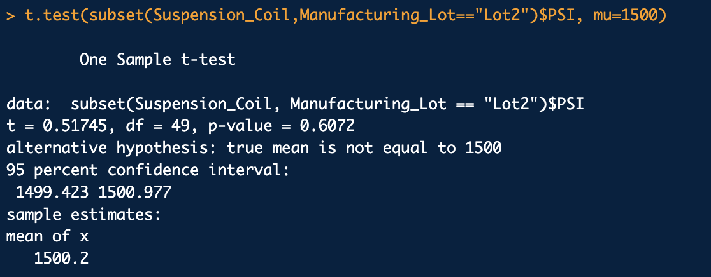

# MechaCar_Statistical_Analysis

## Linear Regression to Predict MPG

From the linear regression output generated below, we are able to see that the variables/coefficients with non-random amount of variance to the mpg values in the data set are vehicle_length and ground_clearance.

The slope of the linear model is not considered to be zero because the intercept is a negative value of  -1.040e+02. 

This linear model predict the mpg of MechaCar prototypes effectively to a large extent.The Multiple R-squared is 0.7149 which means that roughly 71% of the mpg will be correct if we use the model. Also, the p-value is 5.35e-11 which is much smaller 0.05 significance level.

## Summary Statistics on Suspension Coils

After uploading the suspension coils data into a data frame, we produced a set of summary statistics to help ensure that the coils met set design specifications. Those specifications dictate that the variance of suspension coils must not exceed 100 pounds per square inch. Based on the summary statistics produced, the variance of the overall suspension coil data is equal to 62.29356 PSI, which is lower than 100 PSI and therefore meet specifications.

The variance of Lot 1 and Lot 2 are 0.9795918 and 7.4693878 respectively,both of which are also below 100 PSI and as such meet said specifications. For Lot 3 however, it appears that the variance exceeded specifications and came out to 170.2861224.Lot 3 suspension coils might need to be individually revised or modified to ensure that all lots meets specifications. 

## T-Tests on Suspension Coils

To begin, we performed a t test in order to determine whether the mean PSI of the entire suspension coils data is statistically different from the population mean of 1500 PSI. The result of the t test revealed that the p-value = 0.06028. Since the p value is greater than 0.05, we safely concluded that there is no statistically significant difference between the mean PSI of the Suspension_Coil data and the population mean of 1500 PSI.

As for individual manufacturing lots, We use the subset () function within the t test for each individual lot. The first lot(Lot1), produced a p-value = 1 which means that, it being much greater than 0.05, there is no statistically significant difference between the mean PSI for Lot 1 and the population mean of 1500 PSI.

For the second lot (Lot2), the subset t test produced a p-value = 0.6072 which is also higher than 0.05, therefore there was no statistically significant difference between the mean PSI for Lot 2 and the population mean of 1500 PSI as well.

As for Lot 3, the subset t test revealed that p-value = 0.04168.Because the p-value is smaller than 0.05 this time around, we can safely conclude that there is a statistically significant difference between the mean psi of Lot3 and the population mean of 1500 PSI.

## Study Design: MechaCar vs Competition

The purpose of the study designed in this section is to quantify the performance of MechaCar vehicles versus other competitors vehicles. In this study, we would collect data on at least 50 vehicles from MechaCar and 50 vehicles from each of the other competitors, on the following metrics:cost, highway fuel efficiency and safety ratings. We could then design a multiple linear regression model that would assess the cost relative to fuel efficiency and safety rating. We could compute the overall average fuel efficiency of a vehicle a population mean, section MechaCar and Competitors fuel efficiency into lots and perform t tests on those lots. This will helps determine if there is a statistically significant difference between MechaCar and its competitors fuel efficiency and where MechaCar ranks. From there we could begin to design improvements if necessary.